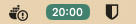
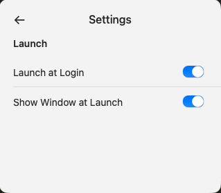
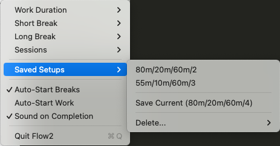

# Flow Pomodoro

A minimal Pomodoro timer for macOS.

This is a clone of [Flow](https://flowapp.info), the Pomodoro app. I wanted something similar with minimal features and the customization options without paying for a subscription plan. The entire app was written by Claude Code (Opus 4.5) - I just described what I wanted.

## How it does look like

### Main Window

<p>
  
  &nbsp;&nbsp;
  
</p>

### Menu Bar

<p>
  
  &nbsp;&nbsp;
  
</p>

### Settings

<p>
  
  &nbsp;&nbsp;
  
</p>

## Features

- Menu bar timer (left-click: show window, right-click: start/pause)
- Work sessions, short breaks, long breaks
- Configurable durations with saved setups
- Keyboard shortcuts: Space (play/pause), Cmd+R (reset), Cmd+→ (skip), Cmd+, (settings)

## Install

Download the latest DMG from [Releases](https://github.com/fserr/flow/releases), open it, and drag Flow2 to Applications.

**First launch**: Right-click the app → Open → Click "Open" in the dialog (required once for unsigned apps).

## Build from source

Requires Xcode.

```bash
git clone https://github.com/fserr/flow.git
cd flow
open Flow.xcodeproj
# Cmd+R to build and run
```
